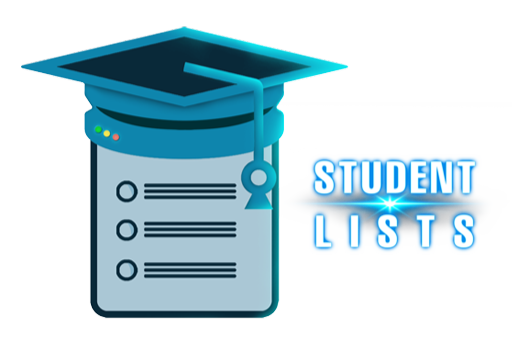

# 📝Student Lists

Student Lists is an Android application designed to efficiently manage and organize student information. It allows users to add and delete student details with robust input and data validation to ensure data integrity. The app supports both portrait and landscape orientations and features a responsive design optimized for various screen sizes. Users can switch between light and dark mode themes for comfortable viewing in any lighting condition, and receive user-friendly toast messages for feedback on actions. The intuitive and clean user interface ensures easy navigation throughout the app.

&nbsp;
## 🪶Features

- Add and delete student details
- Support for both portrait and landscape orientations
- Responsive design optimized for various screen sizes
- Light and dark mode themes for comfortable viewing in any lighting condition
- Robust input and data validation to ensure data integrity
- User-friendly toast messages for feedback on actions
- Intuitive and clean user interface for easy navigation

## ⚙️Tech Stack

- **Java**
- **Android SDK**
- **SQLite**

## 🧑‍💻Authors

- [DarwinRG](https://github.com/DarwinRG)

- [ruseki](https://github.com/ruseki)

&nbsp;

## 🚀Release

The latest release of Student Lists can be found on the [Releases](https://github.com/DarwinRG/StudentLists/releases) page. Check out the release notes for details on the latest features and improvements.

&nbsp;

## 🖼️Screenshots

## 🌑Dark Theme

### Portrait Mode

### Landscape Mode

#### Student List View

#### Delete Dialog View

&nbsp;

## ☀️Light Theme

### Portrait Mode

#### Student List View

#### Delete Dialog View

&nbsp;

### Landscape Mode

&nbsp;

## 🔑License

This project is licensed under the GNU General Public License v3.0 - see the [LICENSE](LICENSE) file for details.
