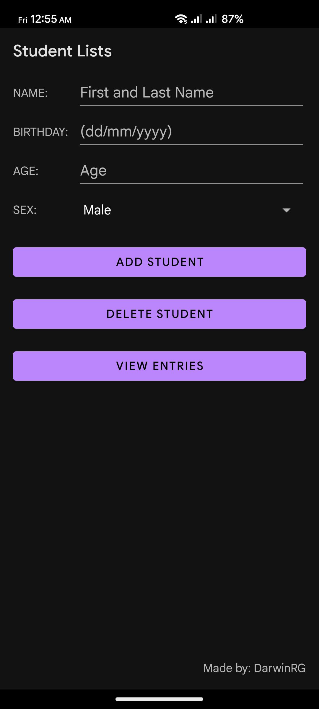
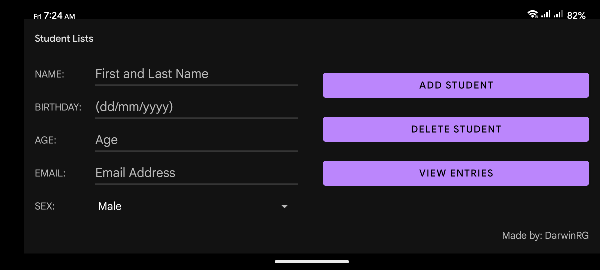
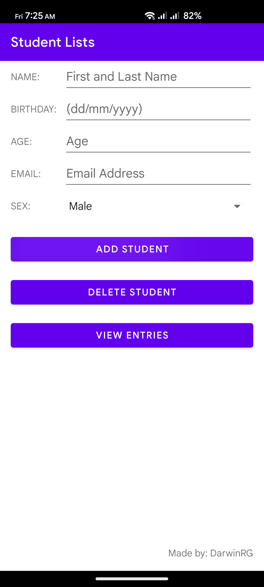

# 📝Student Lists

Student Lists is an Android application designed to manage and organize student information efficiently. It allows users to add, and delete student details. The app is designed to work seamlessly in both portrait and landscape orientations and supports both light and dark mode themes for a comfortable user experience in any lighting condition.

&nbsp;

## 🪶Features

- Add, and delete student details
- Works in all orientation
- Has Light/Dark mode color themes

## ⚙️Tech Stack

- **Java**
- **Android SDK**
- **SQLite**

&nbsp;

## 🧑‍💻Authors

- [DarwinRG](https://github.com/DarwinRG)

- [ruseki](https://github.com/ruseki)

## 🚀Release

The latest release of Student Lists can be found on the [Releases](https://github.com/DarwinRG/StudentLists/releases) page. Check out the release notes for details on the latest features and improvements.

&nbsp;

## 🖼️Screenshots

## 🌑Dark Theme

### Portrait Mode

### Landscape Mode

&nbsp;

## ☀️Light Theme

### Portrait Mode

&nbsp;

### Landscape Mode

&nbsp;

## 🔑License

This project is licensed under the GNU General Public License v3.0 - see the [LICENSE](LICENSE) file for details.
